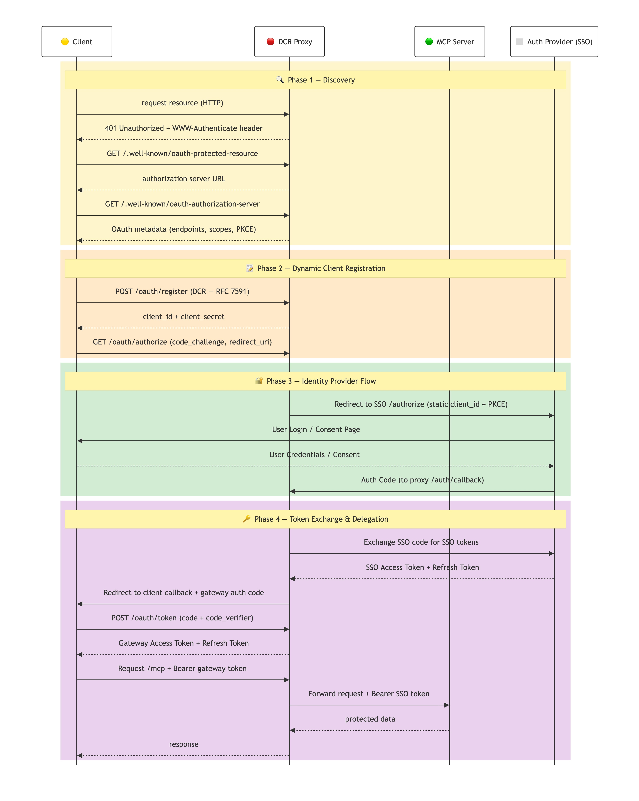

# MCP DCR Proxy

An OAuth gateway that adds **Dynamic Client Registration (RFC 7591)** support to [MCP](https://modelcontextprotocol.io/) servers backed by SSO / Keycloak — without requiring DCR on the SSO side.

## The Problem

MCP clients (such as Cursor, Claude Desktop, and MCP Inspector) rely on OAuth with Dynamic Client Registration (DCR) for authentication. However, some enterprise SSO providers either lack native DCR support or require it to be explicitly enabled and configured. As a result, MCP clients cannot directly connect to certain SSO-protected MCP servers.

**MCP DCR Proxy** sits between the client and SSO:

- Provides a DCR endpoint so MCP clients can self-register
- Handles the full OAuth + PKCE flow on behalf of the client
- Issues its own "gateway" tokens to clients, while keeping real SSO tokens internal
- Forwards authenticated MCP requests to backend servers using the real SSO token


## Quick Start

```bash
# Install
python -m venv .venv && source .venv/bin/activate
pip install -r requirements.txt

# Configure
cp config.example.json config.json
# Edit config.json with your SSO client ID and MCP server URL

# Run
PYTHONPATH=src python -m mcp_proxy --config config.json
```

Then point your MCP client at `http://127.0.0.1:8080/mcp`.

### Cursor

Add to `.cursor/mcp.json`:

```json
{
  "mcpServers": {
    "my-server": { "url": "http://127.0.0.1:8080/mcp" }
  }
}
```

Cursor auto-discovers OAuth, registers via DCR, and opens a browser for SSO login.

### Claude Desktop / MCP Inspector

Same URL (`http://127.0.0.1:8080/mcp`) — all MCP clients that support OAuth will auto-discover the flow.

## How It Works



1. Client connects to `http://proxy:8080/mcp`
2. Proxy returns `401` with a `WWW-Authenticate` header pointing to OAuth metadata
3. Client discovers endpoints via `/.well-known/oauth-authorization-server`
4. Client registers via DCR (`POST /oauth/register`) and gets a `client_id`
5. Client starts an **Authorization Code + PKCE** flow at `/oauth/authorize`
6. Proxy redirects the user's browser to Red Hat SSO for login
7. After login, proxy issues a **gateway token** to the client
8. Client uses the gateway token for all MCP requests
9. Proxy forwards requests to the backend MCP server using the **real SSO token**

### Two Token Layers

MCP clients never see the real SSO token.

| Layer | Held by | Purpose |
|---|---|---|
| **Gateway token** | MCP client | Authenticating to the proxy |
| **SSO token** | Proxy (internal) | Authenticating to backend MCP servers |

## Prerequisites

- **Python 3.10+**
- **A pre-registered OAuth client** in Red Hat SSO (see [Keycloak Client Setup](#keycloak-client-setup))
- **One or more HTTP MCP servers** that accept Bearer token authentication

## Keycloak Client Setup

Your SSO team needs to create a client with these settings:

| Setting | Value |
|---|---|
| Client Protocol | `openid-connect` |
| Access Type | `public` (recommended with PKCE) |
| Standard Flow Enabled | `ON` |
| Direct Access Grants | `OFF` |
| Valid Redirect URIs | `http://127.0.0.1:8080/oauth/callback` |
| PKCE Code Challenge Method | `S256` |
| Scopes | `openid` + any scopes your MCP server requires |

## Configuration

```bash
cp config.example.json config.json
```

```json
{
  "host": "127.0.0.1",
  "port": 8080,
  "oauthIssuer": "https://sso.redhat.com/auth/realms/redhat-external",
  "clientId": "your-client-id",
  "clientSecret": null,
  "scopes": ["openid"],
  "defaultTarget": "https://your-mcp-server.example.com/mcp",
  "sessionTtlMinutes": 480,
  "allowedTargets": null,
  "logLevel": "info"
}
```

| Key | Env Var | Default | Description |
|---|---|---|---|
| `host` | `HOST` | `127.0.0.1` | Bind address |
| `port` | `PORT` | `8080` | Listen port |
| `oauthIssuer` | `OAUTH_ISSUER` | RH SSO staging | OIDC issuer URL |
| `clientId` | `CLIENT_ID` | *required* | Pre-registered SSO client ID |
| `clientSecret` | `CLIENT_SECRET` | `null` | SSO client secret (omit for PKCE) |
| `scopes` | `SCOPES` | `["openid"]` | OAuth scopes to request |
| `defaultTarget` | `DEFAULT_TARGET` | `null` | Default backend MCP server URL |
| `sessionTtlMinutes` | `SESSION_TTL_MINUTES` | `480` | Session idle timeout (minutes) |
| `allowedTargets` | `ALLOWED_TARGETS` | `null` | Whitelist of allowed MCP server URLs |
| `logLevel` | `LOG_LEVEL` | `info` | debug, info, warning, error |

Config priority: **CLI flags > environment variables > config file**.

## Endpoints

### Discovery (no auth)

| Endpoint | Description |
|---|---|
| `GET /.well-known/oauth-protected-resource` | RFC 9728 resource metadata |
| `GET /.well-known/oauth-authorization-server` | RFC 8414 OAuth metadata |

### OAuth

| Endpoint | Description |
|---|---|
| `POST /oauth/register` | DCR — register a new client (RFC 7591) |
| `GET /oauth/authorize` | Start Authorization Code + PKCE flow |
| `GET /oauth/callback` | Receives SSO callback, issues gateway auth code |
| `POST /oauth/token` | Exchange auth code or refresh token for gateway tokens |

### MCP (Bearer token required)

| Endpoint | Description |
|---|---|
| `POST /mcp` | Forward JSON-RPC to default target |
| `POST /mcp?target=URL` | Forward JSON-RPC to a specific target |
| `GET /mcp` | SSE stream passthrough |
| `GET /health` | Health check (no auth) |

## Security

**Target whitelist** — restrict which backend MCP servers clients can reach:

```json
{ "allowedTargets": ["https://mcp-1.example.com/mcp", "https://mcp-2.example.com/mcp"] }
```

**Token isolation** — each client gets its own DCR registration, OAuth session, and gateway token. Clients never see real SSO tokens.

**Token lifetimes:**

| Token | TTL | Notes |
|---|---|---|
| Gateway auth codes | 5 min | Single-use |
| Gateway access tokens | 1 hour | Use refresh token to renew |
| Gateway refresh tokens | 24 hours | Rotation on each use |
| SSO tokens | Per Keycloak config | Auto-refreshed by proxy |
| Sessions | Configurable | Default 8 hours idle timeout |

**Limitations:** All state is in-memory — lost on restart. Clients will need to re-register and re-authenticate. We have plans to include redis to persist the state. to solve this.

## Troubleshooting

| Problem | Solution |
|---|---|
| Client gets 401 | Complete the OAuth flow first. Most MCP clients handle this automatically. |
| SSO shows "Invalid redirect_uri" | Add `http://127.0.0.1:8080/auth/callback` as a Valid Redirect URI in Keycloak. |
| `tools/list` returns 422 | Call `initialize` before any other MCP method. Each target needs its own handshake. |
| Token expired | Clients should use refresh tokens via `POST /oauth/token`. Refresh tokens last 24h. |

For detailed logs: `PYTHONPATH=src python -m mcp_proxy --config config.json --log-level debug`

## Tested With

| Client | Status |
|---|---|
| MCP Inspector | Full flow: DCR → SSO login → tool discovery → tool calls |
| Cursor | DCR + OAuth flow confirmed |
| curl | All endpoints manually verified |

## Contributing

1. Fork the repo
2. Create a feature branch (`git checkout -b feature/my-feature`)
3. Commit and push
4. Open a Pull Request

Ideas: bug reports, docs improvements, additional SSO providers, tests. File issues at [GitHub Issues](https://github.com/riginoommen/dcr-proxy/issues).

## Credits

Built by **[Rigin Oommen](https://github.com/riginoommen)** with assistance from **Cursor AI (Claude)**.

## License

[Apache License 2.0](LICENSE.md) — Copyright 2026 Rigin Oommen
